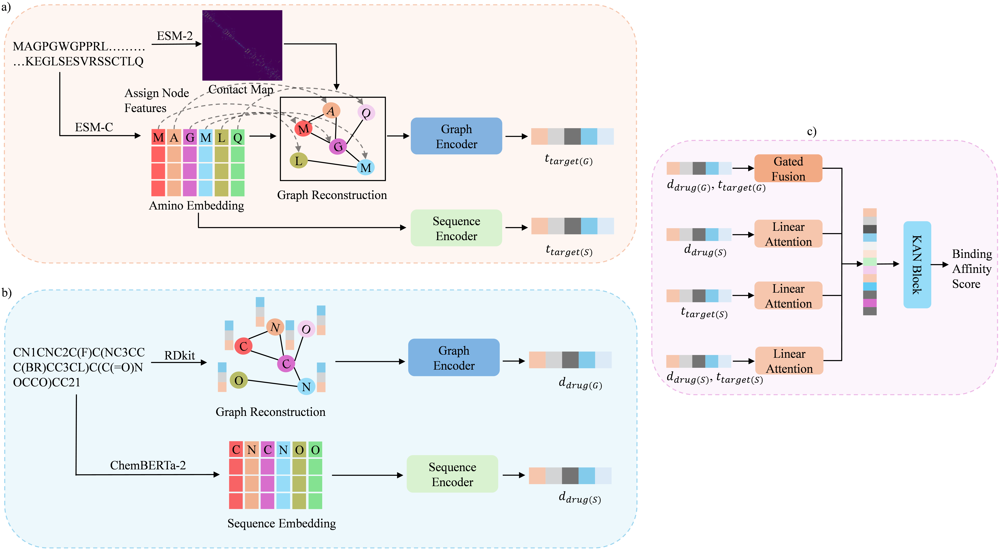

<h1 id="gsik-dta">GSIK-DTA: Graph-Sequence Integration with Kolmogorov–Arnold Networks for Improving Generalizability of Drug–Target Affinity Prediction</h1>

  <!-- Adjust width as needed (e.g., 800–1100) -->
  

<em>Figure 1. GSIK-DTA model architecture.</em>

<h2 id="requirements">Requirements</h2>
<ul>
  <li>Python 3.9.21</li>
  <li>numpy==2.0.2</li>
  <li>pandas==2.2.3</li>
  <li>torch==2.6.0</li>
  <li>transformers==4.49.0</li>
  <li>rdkit==2024.3.2</li>
  <li>fair-esm==2.0.0</li>
</ul>

<h2 id="clone-repository">Clone Repository</h2>
<pre><code>git clone https://github.com/khanonuvov/GSIK-DTA.git
cd GSIK-DTA
</code></pre>

<h2 id="Generate Pretrained Models">Generate Pretrained Models</h2>

For each dataset (<code>davis</code>, <code>kiba</code>, <code>metz</code>, <code>Lung Cancer Test</code>) run these three commands or download the pretrained models from this <a href="">site</a>:

<pre><code>python pretrained/chemberta_pretraiend.py</code></pre>
<pre><code>python pretrained/esmC_pretraiend.py</code></pre>
<pre><code>python pretrained/esm2_map.py</code></pre>

<h2 id="Generate Cold-start Datasets">Generate Cold-start datasets</h2>
<pre><code>python cold_split.py</code></pre>

<h2 id="Train the Model">Train the Model</h2>
<pre><code>python main.py</code></pre>

<h2 id="Prediction">Prediction</h2>
<pre><code>python pred.py</code></pre>

<h2 id="contact">Contact</h2>

  For inquiries, please contact
  <strong>Md Youshuf Khan Rakib</strong> (Email: 
  <a href="mailto:khanushuf4619@csu.edu.cn">khanushuf4619@csu.edu.cn</a>).

